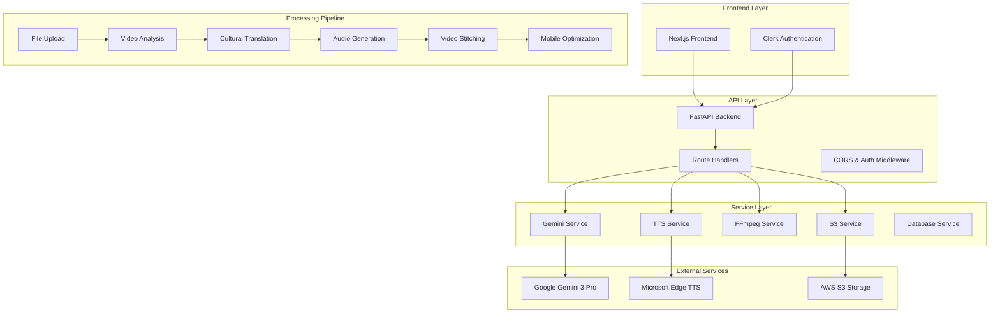
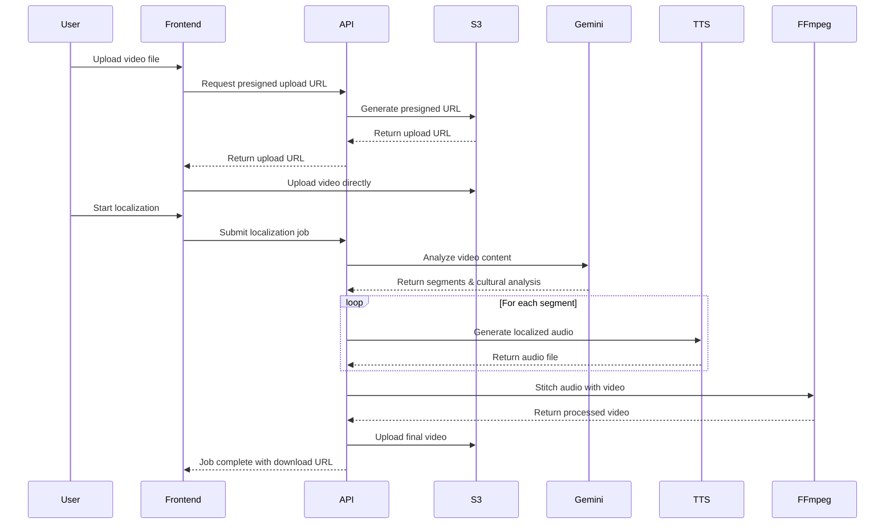

# Design Document

## Overview

Nativity.AI is a comprehensive AI-powered video localization platform designed to transform English video content for Indian regional audiences. The system goes beyond simple translation by performing cultural transcreation, adapting idioms, references, and context to create authentic localized experiences. The platform leverages Google Gemini 3 Pro for intelligent content analysis, edge-tts for natural speech synthesis, and FFmpeg for professional video processing.

The architecture follows a microservices approach with a FastAPI backend, Next.js frontend, and cloud-native storage using AWS S3. The system is designed for scalability, reliability, and ease of use, enabling content creators to reach diverse Indian audiences with culturally appropriate content.

## Architecture

### System Architecture



### Processing Pipeline Flow



## Components and Interfaces

### Frontend Components

#### Video Upload Component
- **Purpose**: Handle secure file uploads to S3
- **Interface**: 
  - Input: File selection, drag-and-drop support
  - Output: Upload progress, file validation feedback
- **Features**: 
  - File type validation (mp4, mov, avi)
  - Size limit enforcement (500MB max)
  - Real-time upload progress
  - Error handling and retry logic

#### Language Selection Component
- **Purpose**: Allow users to select target localization language
- **Interface**:
  - Input: Language preference selection
  - Output: Selected language code
- **Supported Languages**: Hindi, Tamil, Bengali, Telugu, Marathi
- **Features**: Visual language cards with native script display

#### Job Tracking Component
- **Purpose**: Display real-time localization progress
- **Interface**:
  - Input: Job ID from backend
  - Output: Progress percentage, status messages
- **States**: Pending, Uploading, Analyzing, Generating Audio, Stitching, Complete, Failed
- **Features**: WebSocket or polling for real-time updates

#### Quick Translation Component
- **Purpose**: Allow users to test translation capabilities
- **Interface**:
  - Input: Text input field, language selection
  - Output: Original text, translated text, cultural adaptation notes
- **Features**: Real-time translation, cultural adaptation explanations

### Backend Services

#### Gemini Service
- **Purpose**: AI-powered video analysis and cultural transcreation
- **Key Methods**:
  - `analyze_video(video_path, target_language)`: Complete video analysis
  - `generate_translation_draft(video_path, target_language)`: Draft for review
  - `quick_translate(text, target_language)`: Text-only translation
  - `generate_metadata(title, language, description)`: SEO metadata generation
- **Features**:
  - Multimodal video understanding
  - Cultural context adaptation
  - Idiom and metaphor transcreation
  - OCR for on-screen text
  - Retry logic with exponential backoff

#### TTS Service
- **Purpose**: Generate natural-sounding localized audio
- **Key Methods**:
  - `generate_audio_segment(text, language, file_path)`: Single segment audio
  - `generate_segments_from_analysis(segments, language)`: Batch processing
  - `get_voice(language, gender)`: Voice selection
- **Voice Support**:
  - Multiple voices per language (male/female)
  - Rate and pitch adjustment capabilities
  - High-quality neural voices via edge-tts
- **Output**: MP3 audio files with metadata

#### FFmpeg Service
- **Purpose**: Professional video processing and audio integration
- **Key Methods**:
  - `stitch_video(video_path, audio_segments, output_path)`: Main processing
  - `create_whatsapp_version(input_path, output_path)`: Mobile optimization
  - `get_video_info(video_path)`: Metadata extraction
  - `concatenate_audio_segments(audio_files, output_path)`: Audio merging
- **Features**:
  - Audio mixing with background preservation
  - TTS delay synchronization
  - Mobile optimization (<15MB for WhatsApp)
  - Quality preservation options

#### S3 Service
- **Purpose**: Secure cloud storage for videos and assets
- **Key Methods**:
  - `generate_presigned_upload_url(file_name)`: Secure uploads
  - `generate_presigned_download_url(file_key)`: Secure downloads
  - `upload_file(local_path, s3_key)`: Server-side uploads
  - `download_file(s3_key, local_path)`: Server-side downloads
- **Security**: Presigned URLs with expiration, access controls
- **Organization**: Structured key naming (uploads/, outputs/, temp/)

### API Endpoints

#### Upload Endpoints
- `POST /api/upload/presigned-url`: Generate upload URL
- `GET /api/upload/status/{file_key}`: Check upload completion

#### Localization Endpoints
- `POST /api/localize/start`: Begin localization job
- `GET /api/localize/status/{job_id}`: Get job progress
- `POST /api/localize/quick-translate`: Quick text translation

#### Health & Configuration
- `GET /api/health`: Service health check
- `GET /api/config/status`: Configuration validation
- `GET /`: Basic health endpoint

## Data Models

### Core Models

#### VideoSegment
```python
{
    "id": int,
    "start_time": "MM:SS",
    "end_time": "MM:SS", 
    "speaker": str,
    "original_text": str,
    "translated_text": str,
    "cultural_adaptation": {
        "has_idiom": bool,
        "original_idiom": str,
        "adapted_meaning": str,
        "adaptation_note": str
    },
    "on_screen_text": {
        "detected": bool,
        "original": str,
        "translated": str
    }
}
```

#### LocalizationJob
```python
{
    "job_id": str,
    "status": "pending|analyzing|generating_audio|stitching|complete|failed",
    "progress": int,  # 0-100
    "message": str,
    "input_file": str,
    "target_language": str,
    "output_file": str,
    "error": str
}
```

#### CulturalReport
```python
{
    "idioms_adapted": int,
    "cultural_sensitivities": [
        {
            "timestamp": "MM:SS",
            "description": str,
            "recommendation": str
        }
    ],
    "localization_quality_score": int,  # 1-10
    "notes": str
}
```

### Database Schema

#### Jobs Table
- `job_id` (UUID, Primary Key)
- `user_id` (String, Foreign Key)
- `status` (Enum)
- `input_file_key` (String)
- `output_file_key` (String, Nullable)
- `target_language` (String)
- `progress` (Integer, 0-100)
- `error_message` (Text, Nullable)
- `created_at` (Timestamp)
- `updated_at` (Timestamp)
- `completed_at` (Timestamp, Nullable)

#### Analysis Results Table
- `job_id` (UUID, Foreign Key)
- `segments` (JSON)
- `cultural_report` (JSON)
- `video_metadata` (JSON)
- `tts_instructions` (JSON)

## Error Handling

### Error Categories

#### Client Errors (4xx)
- **File Validation Errors**: Invalid format, size exceeded
- **Authentication Errors**: Missing or invalid tokens
- **Request Validation**: Missing required fields, invalid parameters

#### Server Errors (5xx)
- **Service Unavailable**: External API failures (Gemini, S3)
- **Processing Errors**: FFmpeg failures, TTS generation issues
- **Storage Errors**: S3 upload/download failures

#### External Service Errors
- **Gemini API**: Quota exceeded, model unavailable
- **Edge TTS**: Voice unavailable, generation timeout
- **AWS S3**: Access denied, bucket unavailable

### Error Response Format
```python
{
    "error": {
        "code": "SERVICE_UNAVAILABLE",
        "message": "Gemini API is temporarily unavailable",
        "details": {
            "service": "gemini",
            "retry_after": 300,
            "suggestion": "Please try again in a few minutes"
        }
    }
}
```

### Retry Strategies

#### Exponential Backoff
- Initial delay: 5 seconds
- Maximum retries: 10
- Backoff multiplier: 2x
- Applied to: Gemini API calls, S3 operations

#### Circuit Breaker Pattern
- Failure threshold: 5 consecutive failures
- Recovery timeout: 60 seconds
- Applied to: External service calls

## Testing Strategy

### Unit Testing

#### Service Layer Tests
- **Gemini Service**: Mock API responses, test prompt generation
- **TTS Service**: Test voice selection, audio generation
- **FFmpeg Service**: Test video processing, error handling
- **S3 Service**: Test URL generation, file operations

#### Model Validation Tests
- **Pydantic Models**: Test serialization/deserialization
- **Request Validation**: Test input validation rules
- **Response Formatting**: Test API response structures

### Integration Testing

#### API Endpoint Tests
- **Upload Flow**: Test complete upload process
- **Localization Pipeline**: Test end-to-end processing
- **Error Scenarios**: Test failure handling and recovery

#### External Service Integration
- **Gemini API**: Test with sample videos
- **Edge TTS**: Test voice generation
- **AWS S3**: Test file operations

### End-to-End Testing

#### User Journey Tests
- **Complete Localization**: Upload → Process → Download
- **Quick Translation**: Text input → Cultural adaptation
- **Error Recovery**: Handle service failures gracefully

#### Performance Testing
- **Large File Handling**: Test 500MB video processing
- **Concurrent Jobs**: Test multiple simultaneous localizations
- **Load Testing**: Test API under high request volume

### Test Data Management

#### Sample Content
- **Test Videos**: Various lengths, languages, content types
- **Cultural Examples**: Idioms, metaphors, cultural references
- **Edge Cases**: Silent videos, multiple speakers, on-screen text

#### Mock Services
- **Gemini Responses**: Pre-recorded analysis results
- **TTS Audio**: Sample generated audio files
- **S3 Operations**: Local file system simulation

### Continuous Integration

#### Automated Testing Pipeline
1. **Unit Tests**: Run on every commit
2. **Integration Tests**: Run on pull requests
3. **E2E Tests**: Run on staging deployment
4. **Performance Tests**: Run nightly

#### Quality Gates
- **Code Coverage**: Minimum 80%
- **Test Pass Rate**: 100% for critical paths
- **Performance Benchmarks**: Response time thresholds
- **Security Scans**: Dependency vulnerability checks